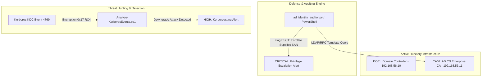

# Active Directory & Identity Defense Lab (AD CS & Kerberoasting)

[](LICENSE)
[](https://github.com/toprakahmetaydogmus/01-ad-identity-defense/actions)
[](https://attack.mitre.org/)
[](#)

Geliştirici: **Toprak Ahmet Aydoğmuş**

---

## 🎯 Proje Amacı ve Kapsamı
Bu laboratuvar ortamı; kurumsal Microsoft Active Directory altyapılarında en sık karşılaşılan iki kritik kimlik saldırı vektörünü (**Active Directory Certificate Services - AD CS Misconfigurations** ve **Kerberoasting**) derinlemesine analiz etmek, otomatize güvenlik denetimleri gerçekleştirmek ve SIEM/Sysmon telemetrisi üzerinden erken aşamada tespit etmek amacıyla tasarlanmıştır.

---

## 🏗️ Mimari ve Telemetri Akışı



---

## 🚀 Temel Özellikler ve Modüller

1. **AD CS ESC1-ESC8 Güvenlik Denetçisi (`scripts/ad_identity_auditor.py`):**
   - Sertifika şablon bayraklarını (`CT_FLAG_ENROLLEE_SUPPLIES_SUBJECT`, Client Authentication EKU, `mspki-enrollment-flag`) ayrıştırır.
   - Düşük yetkili kullanıcıların Domain Admin yetkisine eskalasyonunu sağlayan şablonları belirler ve düzeltme adımlarını listeler.
2. **Kerberos TGS Analiz Motoru (`scripts/Analyze-KerberosEvents.ps1`):**
   - Windows Güvenlik Olayı `4769` (Kerberos Service Ticket Operations) loglarını gerçek zamanlı ayrıştırır.
   - SPN isteklerinde `0x17` (RC4-HMAC) şifreleme düşürme saldırılarını belirler.
3. **Sigma Tespit Kuralları (`rules/`):**
   - `rules/sigma_adcs_esc1.yml`: AD CS şüpheli sertifika talebi tespiti.
   - `rules/sigma_kerberoasting_rc4.yml`: RC4 Kerberoasting tespiti.

---

## 📊 MITRE ATT&CK Eşleme Tablosu

| Teknik ID | Teknik Adı | Taktik | Tespit Kaynağı | Savunma Mekanizması |
|---|---|---|---|---|
| **T1649** | Steal or Forge Authentication Certificates | Credential Access | WinEvent 4887 / AD CS Audit | Şablonlarda SAN kısıtlaması & Yönetici onayı |
| **T1558.003** | Kerberoasting (RC4 Ticket Extraction) | Credential Access | WinEvent 4769 (Enc: `0x17`) | AES-256 zorunluluğu & gMSA kullanımı |

---

## ⚡ Hızlı Başlangıç & Test

### Gereksinimler
- Python 3.10+ veya PowerShell 5.1+
- Git

```bash
# 1. Depoyu klonlayın
git clone https://github.com/toprakahmetaydogmus/01-ad-identity-defense.git
cd 01-ad-identity-defense

# 2. Otomatik test paketini çalıştırın
python -m unittest discover tests/

# 3. CLI denetim motorunu çalıştırın
python scripts/ad_identity_auditor.py
```

---

## 📜 Lisans ve Sorumluluk Reddi
Bu proje [MIT Lisansı](LICENSE) ile korunmaktadır. Yazar: **Toprak Ahmet Aydoğmuş**.  
*Tüm IP adresleri ve yapılandırmalar RFC 1918 / RFC 5737 test standartlarına uygundur.*
