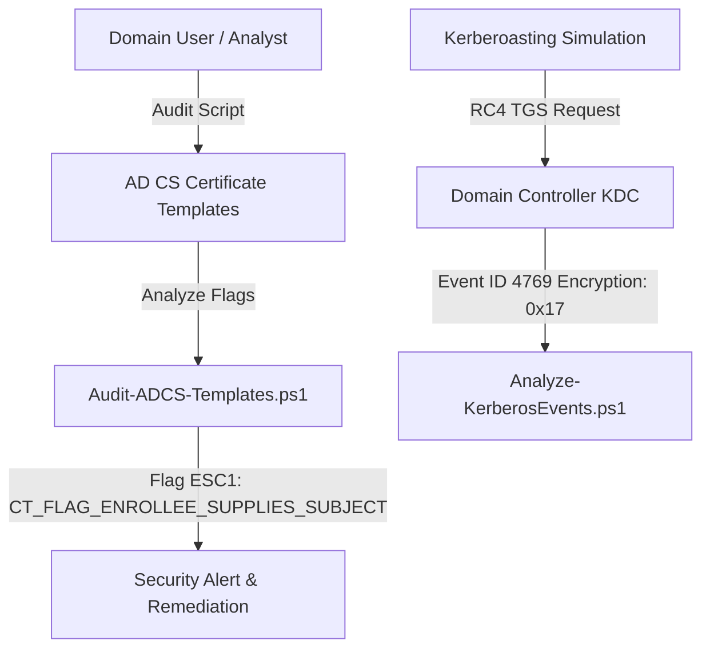

# Active Directory & Identity Defense Lab
[](LICENSE)
[](#)
[](#)

Geliştirici: **Toprak Ahmet Aydoğmuş**

Bu laboratuvar; kurumsal Active Directory ortamlarında kimlik güvenliği, **Active Directory Certificate Services (AD CS)** yanlış yapılandırma denetimi (ESC1-ESC8) ve **Kerberoasting** saldırı tespiti için geliştirilmiş eksiksiz PowerShell denetim motoru ve Sigma tespit kurallarını içerir.

## Mimari Şema


## Dosyalar ve Araçlar
- `scripts/Audit-ADCS-Templates.ps1`: Sertifika şablonlarını ESC1, ESC2, ESC3, ESC4 risklerine karşı denetleyen analiz motoru.
- `scripts/Analyze-KerberosEvents.ps1`: Kerberos TGS isteklerini (Event 4769) inceleyip RC4 şifreleme düşürme (downgrade) saldırılarını tespit eden analiz motoru.
- `rules/sigma_adcs_esc1.yml`: AD CS şüpheli sertifika talebi Sigma kuralı.
- `rules/sigma_kerberoasting_rc4.yml`: RC4 Kerberoasting tespiti Sigma kuralı.

## Hızlı Başlangıç & Test
```powershell
# 1. AD CS Sertifika Şablonu Güvenlik Denetimini Çalıştırın
.\scripts\Audit-ADCS-Templates.ps1

# 2. Kerberoasting Event Log Analizini Çalıştırın
.\scripts\Analyze-KerberosEvents.ps1
```

## Lisans
MIT License - Toprak Ahmet Aydoğmuş
